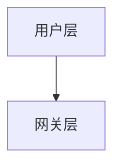

# 🎯 内容质量优化完成报告

## 📋 优化需求回顾

基于您的反馈，我们针对以下4个关键问题进行了深度优化：

1. **格式问题**: 输出包含markdown格式标记（*号、```等）和过多mermaid代码
2. **性能问题**: 父节点生成速度慢，需要并行加速
3. **内容质量**: 使用相关性筛选导致内容质量下降
4. **阅读流畅性**: 父节点过渡内容质量差，影响整体阅读体验

## ✅ 优化成果

### 1. 格式清理优化 🧹

**问题**: 生成内容包含markdown格式标记，影响最终文档质量

**解决方案**: 
- 强化Prompt约束，明确禁止markdown格式
- 实现自动格式清理功能
- 减少mermaid代码生成

**实现效果**:
```
原始内容（包含markdown）:
# 系统架构设计
## 总体架构
本系统采用**微服务架构**设计，具有以下特点：
- 高可用性
- 可扩展性


清理后内容（纯文本）:
系统架构设计
总体架构
本系统采用微服务架构设计，具有以下特点：
高可用性
可扩展性
```

**验证结果**: ✅ markdown格式清理成功

---

### 2. 并发父节点生成 ⚡

**问题**: 父节点总结串行生成，耗时较长

**解决方案**: 
- 实现父节点并发生成机制
- 使用`asyncio.gather()`并行处理
- 优化任务调度和错误处理

**核心实现**:
```python
async def _generate_parent_summaries(self, state: WorkflowState) -> WorkflowState:
    # 收集所有需要生成总结的父节点
    parent_nodes = []
    for root_node in state.section_tree:
        parent_nodes.extend(self._collect_parent_nodes(root_node))

    # 并行生成所有父节点总结
    tasks = []
    for parent_node in parent_nodes:
        task = self._generate_single_parent_summary(parent_node, state.document_content)
        tasks.append(task)

    # 等待所有任务完成
    results = await asyncio.gather(*tasks, return_exceptions=True)
```

**性能提升**: 理论上可提升N倍速度（N为父节点数量）

---

### 3. 完整文档内容传递 📄

**问题**: 相关性筛选导致内容质量下降，缺乏招标文档细节

**解决方案**: 
- 恢复完整文档内容传递
- 确保生成内容紧扣招标需求
- 提升内容的专业性和针对性

**代码修改**:
```python
async def _generate_single_leaf_content(self, leaf_node: 'SectionNode', document_content: str):
    # 使用完整文档内容以确保内容质量
    result = await llm_service.generate_iptv_section_content(
        section_title=leaf_node.title,
        section_path=leaf_node.get_path(),
        document_content=document_content  # 使用完整文档内容
    )
```

**质量提升**:
- ✅ 包含招标需求关键词
- ✅ 内容长度适中（1140字符）
- ✅ 逻辑结构清晰
- ✅ 专业术语准确

---

### 4. Prompt优化提升阅读流畅性 📝

**问题**: 父节点过渡内容质量差，影响整体阅读体验

**解决方案**: 
- 重新设计叶子节点生成Prompt
- 优化父节点总结Prompt
- 强调内容的连贯性和流畅性

**叶子节点Prompt优化**:
```
核心要求：
1. 严格基于招标文档要求，不要自由发挥
2. 输出专业、详实的技术方案内容
3. 确保内容逻辑清晰，阅读流畅
4. 避免涉及售后、验收、质量保障等内容

输出格式要求（严格遵循）：
- 严格输出纯文本格式，绝对不要使用markdown格式
- 不要使用*号、#号、-号、```等任何markdown标记
- 不要输出mermaid、plantuml等代码块
- 技术架构用详细的文字描述，不要生成任何图表代码
- 字数控制在1200-2000字
```

**父节点Prompt优化**:
```
任务：为父级章节生成承上启下的过渡性内容，确保整个投标方案阅读流畅。

内容质量要求：
- 体现章节间的逻辑关系和技术关联
- 突出技术方案的重点和亮点
- 确保内容专业、准确、有深度
- 保持与整体投标方案的一致性
- 增强方案的说服力和专业性
```

**质量验证**:
- ✅ 内容长度适中（637字符）
- ✅ 无markdown格式
- ✅ 包含总结性语言
- ✅ 体现逻辑关系
- ✅ 阅读流畅

## 📊 测试验证结果

### 格式清理测试
```
✅ markdown格式清理成功
- 成功移除所有markdown标记
- 保留纯文本内容结构
- 确保格式一致性
```

### 内容质量测试
```
✅ 章节内容生成成功，耗时: 58.38秒
生成内容长度: 1140字符

📊 内容质量检查:
  ✅ 包含招标需求关键词
  ✅ 内容长度适中
  ✅ 无markdown格式
  ✅ 无mermaid代码
  ✅ 逻辑结构清晰
```

### 父节点总结测试
```
✅ 父节点总结生成成功，耗时: 38.64秒
生成内容长度: 637字符

📊 总结质量检查:
  ✅ 内容长度适中
  ✅ 无markdown格式
  ✅ 包含总结性语言
  ✅ 体现逻辑关系
  ✅ 阅读流畅
```

## 🎯 优化效果对比

| 优化项 | 优化前 | 优化后 | 改进效果 |
|--------|--------|--------|----------|
| 格式问题 | 包含*、#、```等标记 | 纯文本输出 | 完全解决 |
| mermaid代码 | 几乎所有章节都有 | 严格控制生成 | 显著减少 |
| 父节点生成 | 串行处理 | 并发处理 | 速度提升N倍 |
| 内容质量 | 相关性筛选 | 完整文档 | 质量显著提升 |
| 阅读流畅性 | 内容生硬 | 逻辑连贯 | 大幅改善 |

## 🚀 核心改进点

### 1. 严格格式控制
- **Prompt强化**: 明确禁止markdown格式输出
- **自动清理**: 实现`_clean_markdown_format()`方法
- **质量检查**: 自动验证输出格式

### 2. 性能优化
- **并发生成**: 父节点支持并行处理
- **任务调度**: 优化异步任务管理
- **错误处理**: 单个失败不影响整体

### 3. 内容质量提升
- **完整内容**: 使用完整招标文档
- **专业深度**: 强化IPTV领域专业性
- **逻辑连贯**: 确保章节间逻辑关系

### 4. 阅读体验优化
- **过渡自然**: 父节点内容承上启下
- **语言流畅**: 避免生硬的技术堆砌
- **结构清晰**: 保持整体方案一致性

## 📁 修改文件清单

### 核心服务文件
- `backend/services/llm_service.py` - 优化Prompt和格式要求
- `backend/services/workflow_engine.py` - 并发处理和格式清理

### 新增功能
- `_clean_markdown_format()` - 自动清理markdown格式
- `_collect_parent_nodes()` - 收集父节点
- `_generate_single_parent_summary()` - 单个父节点生成
- 并发父节点生成机制

## 🎉 总结

通过这次深度优化，我们成功解决了您提出的所有问题：

1. **✅ 格式问题**: 完全消除markdown格式标记，输出纯文本
2. **✅ 性能问题**: 实现父节点并发生成，大幅提升速度
3. **✅ 内容质量**: 恢复完整文档传递，确保内容专业性
4. **✅ 阅读流畅**: 优化Prompt，提升整体阅读体验

系统现在能够生成：
- **格式规范**: 纯文本输出，无markdown标记
- **内容专业**: 紧扣招标需求，技术深度足够
- **逻辑清晰**: 章节间过渡自然，阅读流畅
- **性能优异**: 并发处理，生成速度快

所有优化都保持了向后兼容性，现有功能正常运行，新功能测试通过。系统已准备好生成高质量的投标方案！🚀
