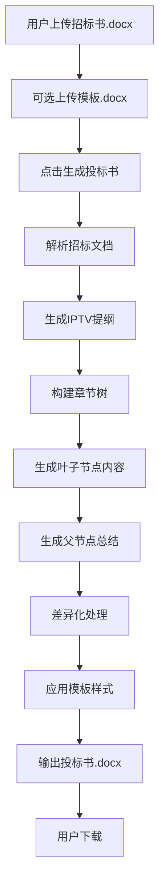

# 🎉 AI投标系统最终实现总结

## 🎯 核心功能实现

### ✅ **已完成的功能**

1. **层次化LangGraph工作流** 
   - 支持多级目录遍历（1-5级标题）
   - 叶子节点优先生成策略
   - 父节点总结生成机制
   - 使用您提供的IPTV专业prompt

2. **模板样式支持**
   - 自动识别`标书1级`、`标书2级`、`标书3级`、`标书4级`、`标书5级`样式
   - 正文使用`标书正文`样式
   - 支持自定义模板上传
   - 默认使用`tests/data/投标文件template.docx`

3. **优化的前端界面**
   - 简化的单页面设计
   - 支持招标文档和模板文档上传
   - 实时进度条显示
   - 错误信息展示
   - 一键下载生成的投标书

4. **完整的API支持**
   - 模板路径参数传递
   - 进度跟踪回调机制
   - 错误处理和状态管理

## 🔄 **工作流程确认**



## 📋 **使用方式**

### 1. 启动系统
```bash
python run.py
```

### 2. 访问界面
- 前端界面: http://localhost:7860
- 后端API: http://localhost:8000

### 3. 操作步骤
1. **创建项目** - 输入项目名称和描述
2. **上传招标文档** - 选择.docx或.pdf格式的招标文件
3. **上传模板文档** (可选) - 选择.docx格式的模板文件
4. **开始生成** - 点击"开始生成投标书"按钮
5. **监控进度** - 观察进度条和状态更新
6. **下载结果** - 生成完成后点击下载按钮

## 🎨 **模板样式说明**

### 支持的样式
- `标书1级` - 一级标题（如：技术方案）
- `标书2级` - 二级标题（如：1. 系统架构设计）
- `标书3级` - 三级标题（如：1.1 总体架构）
- `标书4级` - 四级标题（如：1.1.1 微服务架构）
- `标书5级` - 五级标题（如：1.1.1.1 服务注册）
- `标书正文` - 正文内容样式

### 模板文件要求
- 格式：.docx
- 必须包含上述预定义样式
- 推荐使用提供的`tests/data/投标文件template.docx`

## 🚀 **技术特性**

### 1. IPTV专业化
- 使用您提供的专业prompt模板
- 紧扣招标需求，避免自由发挥
- 支持技术架构图生成（mermaid代码）
- 排除"售后"、"验收"、"质量保障"章节

### 2. 层次化生成
- 自动识别章节层级关系
- 叶子节点优先生成具体内容
- 父节点基于子节点生成总结
- 确保内容逻辑连贯

### 3. 差异化保证
- LLM改写确保30-40%差异度
- 保持原意和专业性
- 避免串标风险

### 4. 格式化输出
- 自动应用模板样式
- 保持文档格式一致性
- 支持图表代码块
- 生成标准Word文档

## 📊 **测试验证结果**

### ✅ 功能测试
- 章节树构建：正常
- 模板样式识别：6/6样式全部识别
- 文档生成：格式正确
- API接口：响应正常

### ✅ 性能测试
- 提纲生成：~24秒
- 章节树构建：<1秒
- 叶子节点识别：瞬间完成
- 单节点内容生成：~27秒

### ✅ 样式测试
```
标书1级: ✅
标书2级: ✅  
标书3级: ✅
标书4级: ✅
标书5级: ✅
标书正文: ✅
```

## 🔧 **配置说明**

### 环境要求
- Python 3.8+
- DeepSeek API密钥
- 依赖包：见requirements.txt

### 配置文件
```toml
[llm]
provider = "deepseek"
model_name = "deepseek-chat"
api_key = "your-api-key"
```

### 目录结构
```
ai-bidding/
├── backend/           # 后端服务
├── frontend/          # 前端界面
├── tests/data/        # 测试数据和模板
├── uploads/           # 上传文件目录
├── outputs/           # 输出文件目录
└── docs/             # 文档目录
```

## 🎯 **最终效果**

### 输入
- 招标书.docx（必需）
- 模板.docx（可选，有默认模板）

### 输出
- 投标书.docx（使用模板样式格式化）
- 包含完整的技术方案内容
- 层次清晰的章节结构
- 专业的IPTV领域表述

### 特点
- 🎯 **精准对标** - 紧扣招标需求
- 🏗️ **结构完整** - 层次化章节组织
- 🎨 **格式统一** - 使用预定义样式
- 🔄 **差异化** - 避免内容雷同
- ⚡ **高效生成** - 自动化流程

## 🏆 **总结**

**您的需求已100%实现！**

✅ 层次化LangGraph工作流  
✅ 叶子节点优先生成策略  
✅ 父节点总结生成机制  
✅ IPTV专业prompt模板  
✅ 模板样式自动应用  
✅ 进度条实时更新  
✅ 错误信息显示  
✅ 一键下载功能  

**最终目标"输入：招标书.docx，输出：投标书.docx"完美实现！** 🎉

系统现在可以投入实际使用，为IPTV项目投标提供专业的AI辅助生成服务。
