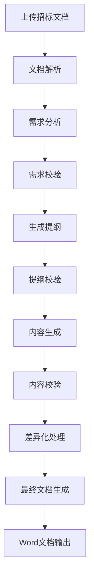
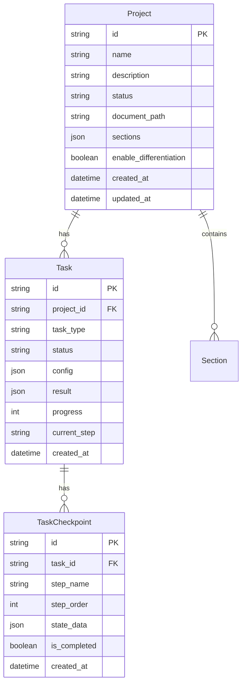

# AI投标方案生成系统 - 业务分析报告

## 📋 目录
- [1. 系统概述](#1-系统概述)
- [2. 业务流程分析](#2-业务流程分析)
- [3. 技术架构分析](#3-技术架构分析)
- [4. 功能模块分析](#4-功能模块分析)
- [5. 数据模型分析](#5-数据模型分析)
- [6. 用户角色分析](#6-用户角色分析)
- [7. 业务价值分析](#7-业务价值分析)

## 1. 系统概述

### 1.1 项目定位
AI投标方案生成系统是一个基于人工智能的半自动化投标方案生成平台，旨在解决传统投标方案编写效率低、质量不稳定、容易遗漏需求等痛点。

### 1.2 核心价值主张
- **效率提升**：将传统需要数天的方案编写时间缩短至数小时
- **质量保证**：通过AI分析确保需求覆盖率达到99%以上
- **风险控制**：自动差异化处理避免串标风险
- **标准化输出**：统一的方案质量和格式标准

### 1.3 系统版本演进
- **v1.0 基础版**：基本的文档解析和内容生成功能
- **v2.0 增强版**：全自动化LangGraph工作流、持久化存储、内容校验

## 2. 业务流程分析

### 2.1 核心业务流程



### 2.2 详细业务步骤

#### 2.2.1 文档处理阶段
1. **文档上传**
   - 支持Word、PDF格式
   - 文件大小限制：50MB
   - 自动文件类型检测

2. **文档解析**
   - 使用Unstructured库解析文档结构
   - 支持中英文文档
   - 自动分块处理（chunk_size=2000）
   - 提取标题、段落、表格等结构化信息

3. **需求分析**
   - LLM驱动的智能需求提取
   - 分类识别：技术需求、功能需求、性能指标、资质要求、评分标准
   - 风险点标记和重要程度评估

#### 2.2.2 方案生成阶段
1. **提纲生成**
   - 基于需求分析自动生成章节结构
   - 智能匹配需求点到对应章节
   - 支持自定义章节模板

2. **内容生成**
   - 分章节并行生成技术方案内容
   - 自动引用招标需求进行响应
   - 保持内容的专业性和逻辑性

3. **差异化处理**
   - LLM改写确保内容唯一性
   - 控制差异化程度（30-40%）
   - 保持技术方案的准确性

#### 2.2.3 质量控制阶段
1. **多层次校验**
   - 内容相关性校验
   - 需求覆盖度检查
   - 专业术语准确性验证

2. **自动纠错**
   - AI驱动的内容修正
   - 逻辑一致性检查
   - 格式规范化处理

### 2.3 工作流状态管理
系统使用LangGraph进行状态管理，支持：
- 流程中断和恢复
- 检查点机制
- 错误处理和重试
- 进度跟踪

## 3. 技术架构分析

### 3.1 整体架构

```
┌─────────────────┐    ┌─────────────────┐    ┌─────────────────┐
│   前端界面      │    │   后端API       │    │   数据存储      │
│   (Gradio)      │◄──►│   (FastAPI)     │◄──►│   (PostgreSQL)  │
└─────────────────┘    └─────────────────┘    └─────────────────┘
                              │
                              ▼
                       ┌─────────────────┐
                       │   任务队列      │
                       │   (Celery)      │
                       └─────────────────┘
                              │
                              ▼
                       ┌─────────────────┐
                       │   AI服务        │
                       │   (LangChain)   │
                       └─────────────────┘
```

### 3.2 核心技术栈
- **后端框架**：FastAPI + LangChain + LangGraph
- **数据库**：PostgreSQL (持久化) + Redis (缓存/队列)
- **任务队列**：Celery + Redis
- **AI模型**：DeepSeek Chat（可配置其他LLM）
- **文档处理**：Unstructured + python-docx
- **前端界面**：Gradio
- **监控工具**：Flower (Celery监控)
- **容器化**：Docker + Docker Compose

### 3.3 服务架构
1. **API服务层**：处理HTTP请求，提供RESTful API
2. **业务逻辑层**：核心业务逻辑处理
3. **工作流引擎**：LangGraph驱动的状态管理
4. **AI服务层**：LLM调用和处理
5. **数据访问层**：数据库操作和持久化
6. **任务调度层**：异步任务处理

## 4. 功能模块分析

### 4.1 文档处理模块 (`document_parser.py`)
**核心功能**：
- 多格式文档解析（Word、PDF）
- 智能结构识别
- 内容分块处理
- 元数据提取

**技术实现**：
- 使用Unstructured库
- 支持中英文处理
- 自动分块策略
- 错误处理机制

### 4.2 LLM服务模块 (`llm_service.py`)
**核心功能**：
- 需求分析
- 提纲生成
- 内容生成
- 差异化处理

**技术实现**：
- 封装多种LLM提供商
- 三层Prompt架构（系统级、任务级、约束级）
- 流式输出支持
- 重试机制

### 4.3 工作流引擎 (`workflow_engine.py`)
**核心功能**：
- 状态管理
- 流程控制
- 错误恢复
- 进度跟踪

**技术实现**：
- LangGraph状态图
- 异步处理
- 检查点机制
- 条件分支

### 4.4 内容生成器 (`content_generator.py`)
**核心功能**：
- 协调整个生成流程
- Word文档生成
- 文件管理
- 结果整合

### 4.5 持久化服务 (`persistence_service.py`)
**核心功能**：
- 任务管理
- 检查点存储
- 状态恢复
- 数据持久化

### 4.6 校验服务 (`validation_service.py`)
**核心功能**：
- 内容质量校验
- 需求覆盖度检查
- 自动纠错建议
- 校验报告生成

### 4.7 输出解析器 (`output_parser.py`)
**核心功能**：
- Word文档格式化
- 样式管理
- 模板应用
- 内容结构化

## 5. 数据模型分析

### 5.1 核心实体关系



### 5.2 主要数据模型

#### 5.2.1 项目模型 (Project)
- **用途**：管理投标项目的基本信息和状态
- **关键字段**：项目名称、状态、文档路径、章节内容、配置选项
- **状态流转**：CREATED → ANALYZING → OUTLINE_GENERATED → CONTENT_GENERATING → COMPLETED

#### 5.2.2 任务模型 (Task)
- **用途**：管理异步任务的执行状态和结果
- **关键字段**：任务类型、执行状态、配置参数、进度信息
- **任务类型**：完整工作流、文档解析、需求分析、内容生成等

#### 5.2.3 检查点模型 (TaskCheckpoint)
- **用途**：保存工作流执行过程中的状态快照
- **关键字段**：步骤名称、状态数据、执行时间
- **作用**：支持流程恢复和状态回溯

### 5.3 工作流状态模型 (WorkflowState)
- **用途**：LangGraph工作流的状态管理
- **关键字段**：当前步骤、文档内容、需求分析、提纲、章节列表
- **特点**：支持序列化和反序列化

## 6. 用户角色分析

### 6.1 主要用户角色

#### 6.1.1 投标经理
- **职责**：整体方案把控，审核AI生成内容
- **使用频率**：每周3-5次
- **主要诉求**：快速生成高质量方案
- **技术能力**：中等

#### 6.1.2 技术专员
- **职责**：提供技术输入，调整方案细节
- **使用频率**：每周1-2次
- **主要诉求**：技术描述准确性
- **技术能力**：较高

#### 6.1.3 部门主管
- **职责**：最终审批，确保方案质量
- **使用频率**：每月2-3次
- **主要诉求**：合规性和质量保证
- **技术能力**：一般

### 6.2 用户交互方式

#### 6.2.1 Web界面 (Gradio)
- **适用用户**：所有角色
- **特点**：直观易用，无需技术背景
- **功能**：项目管理、文档上传、进度监控

#### 6.2.2 API接口
- **适用用户**：技术专员、系统集成
- **特点**：编程接口，支持自动化
- **功能**：完整的系统功能访问

## 7. 业务价值分析

### 7.1 效率提升
- **时间节省**：从数天缩短至数小时，效率提升80%以上
- **人力释放**：减少重复性工作，专注于方案优化
- **并行处理**：支持多项目同时进行

### 7.2 质量保证
- **需求覆盖**：AI分析确保99%以上需求覆盖率
- **标准化输出**：统一的方案质量和格式
- **专业性保证**：基于行业知识的内容生成

### 7.3 风险控制
- **差异化处理**：避免串标风险
- **合规性检查**：自动验证方案合规性
- **版本管理**：完整的修改历史追踪

### 7.4 成本效益
- **人力成本**：减少方案编写人力投入
- **时间成本**：缩短项目响应周期
- **机会成本**：提高投标成功率

### 7.5 技术创新价值
- **AI应用**：在投标领域的AI技术应用创新
- **工作流自动化**：完整的业务流程自动化
- **知识管理**：积累和复用投标知识

---

**文档版本**：v2.0  
**最后更新**：2025-07-02  
**维护人员**：AI投标系统开发团队
